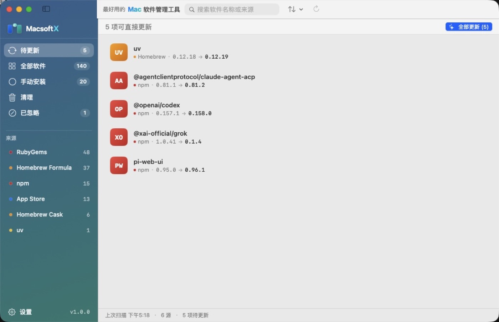

# Macsoft X

Mac 菜单栏软件更新管理器。



Mac 上的软件更新散在四个互不相通的地方：

- 手动拖进 `/Applications` 的应用
- App Store 应用
- Homebrew 的 formula 和 cask
- 终端里的命令行工具：npm、gem、uv

Macsoft X 把这四个渠道收进同一个菜单栏面板。打开就知道哪几个软件该更新了，逐个点或者一次全更——不用开一堆终端窗口，也不用挨个点开应用去菜单里找「检查更新」。

## 功能

### 更新

- 四个渠道一次扫完，每个软件都标出来源
- **手动安装的应用也能直接更新**。从 Homebrew 的 cask 定义里查到最新版本号做比对，执行 `brew install --cask --force` 装上新版，之后这个应用就归 Homebrew 管了
- 一键全部更新，或只更新指定的几个
- 通知只在出现新的可更新项时发，更完一批不会再打扰你

### 软件清单

- 全盘扫描，列出所有已安装的软件，标注来源（App Store / Homebrew / 独立安装 / npm / gem …）
- 搜索、按来源筛选、按类别（应用 / 命令行）筛选

### 卸载与清理

- 卸载软件：归包管理器管的走它自己的卸载命令，独立安装的移入废纸篓
- 扫描已卸载软件留下的残留：配置、缓存、日志、容器，按占用大小排序
- 删除操作一律进废纸篓，随时能恢复

### 其他

- 常驻菜单栏，图标上直接显示待更新数量
- 定时扫描，间隔可配置
- 忽略规则：不想更新的软件可以永久或临时跳过
- 开机自启
- 浅色 / 深色 / 跟随系统

## 免费开源

MIT 协议。没有内购，没有订阅，没有广告，不需要注册账号。

不采集数据，也不上传信息。唯一的网络请求是查询 Homebrew 公共 API 的应用版本号，以及读取各个应用自己公布的更新源。

代码全部在 GitHub 上，可以自己审计、自己编译、随意修改。

## 安装

从 [Releases](https://github.com/Jimmyzxk/MacSoftX/releases/latest) 下载 `MacsoftX-1.0.1.dmg`，打开后把 Macsoft X 拖进「应用程序」。

需要 **macOS 15 或更高**。

应用没有做 Apple 公证（需要 99 美元/年的开发者账号），首次打开会被 Gatekeeper 拦下。在「系统设置 → 隐私与安全性」里点「仍要打开」，或者执行：

```bash
xattr -d com.apple.quarantine /Applications/Macsoft\ X.app
```

### 可选依赖

下面这些工具都是可选的。缺哪个就自动跳过对应的更新源，其他功能照常。

| 工具 | 用途 | 安装 |
|---|---|---|
| Homebrew | formula 与 cask 更新 | [brew.sh](https://brew.sh) |
| `mas` | App Store 更新 | 应用内一键安装，或 `brew install mas` |
| Node.js | npm 全局包更新 | [nodejs.org](https://nodejs.org) |
| Ruby | gem 更新 | 系统自带 |
| `uv` | uv tool 更新 | [astral.sh/uv](https://astral.sh/uv) |

## 从源码构建

```bash
git clone https://github.com/Jimmyzxk/MacSoftX.git
cd MacSoftX
swift build -c release
./Scripts/make-app.sh
```

产物在 `build/Macsoft X.app`。项目零第三方依赖，只用系统框架。

- **运行要求**：macOS 15 或更高
- **构建要求**：Xcode 26 或更高（工具栏布局用了 macOS 26 引入的 `ToolbarSpacer`；用更早的 Xcode 构建会报 `cannot find 'ToolbarSpacer' in scope`）

## 命令行

除图形界面外还提供 JSON 输出，方便脚本化和排查问题：

```bash
.build/debug/upmac --scan          # 全源扫描
.build/debug/upmac --scan-fast     # 跳过 cask 网络检测的快速扫描
.build/debug/upmac --inventory     # 已装软件清单
```

## 开发

```bash
swift build -Xswiftc -warnings-as-errors   # 零警告构建
swift test                                 # 132 项单元测试
```

架构与扩展方式见 [CONTRIBUTING.md](CONTRIBUTING.md)，新增一个包管理器只需实现 `UpdateProvider` 协议。

## 文档

| 文档 | 内容 |
|---|---|
| [docs/01-architecture.md](docs/01-architecture.md) | 架构与 Provider 协议 |
| [docs/08-design-spec.md](docs/08-design-spec.md) | 设计规范 |
| [docs/13-install.md](docs/13-install.md) | 安装与分发 |
| [docs/14-audit-20260924.md](docs/14-audit-20260924.md) | 代码审计报告 |
| [CONTRIBUTING.md](CONTRIBUTING.md) | 贡献指南与安全约束 |

## 许可

[MIT](LICENSE)
